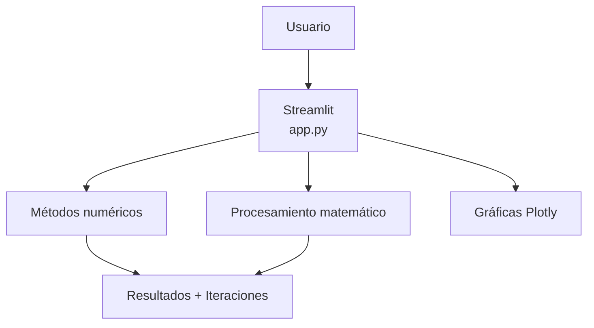
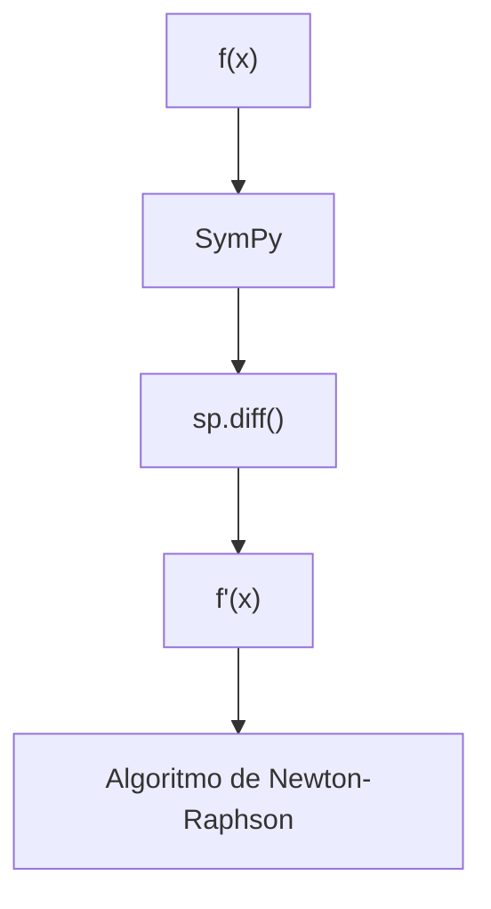
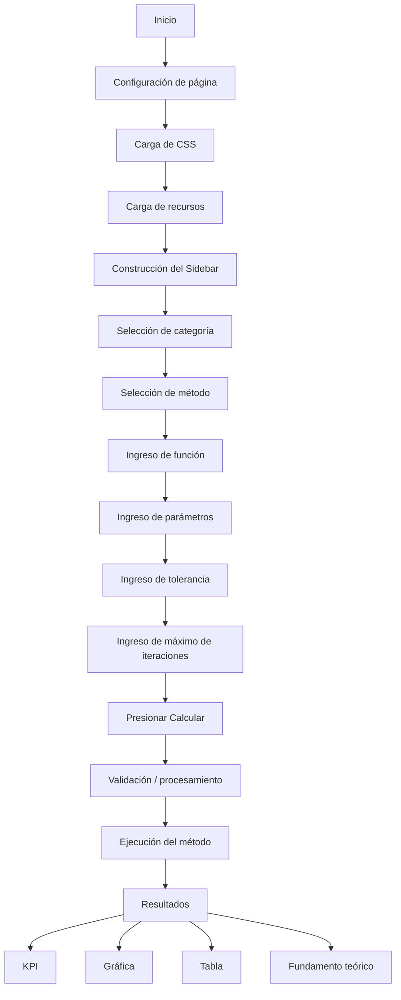
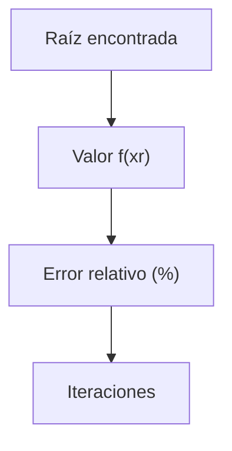
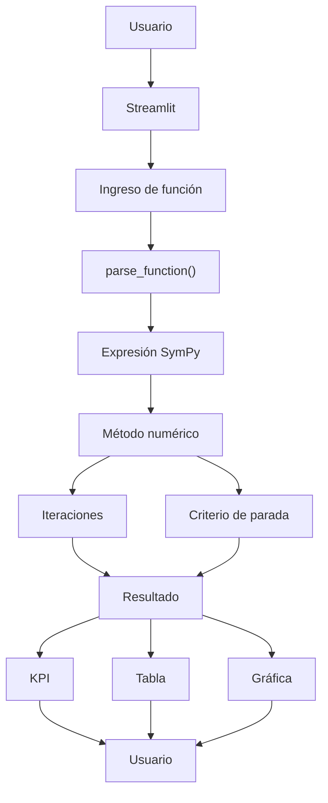

# 🛠️ Manual Técnico — Numerix

> **Sistema de resolución y visualización de métodos numéricos**

---

# 1. Descripción general

**Numerix** es una aplicación web desarrollada en Python para la resolución de ecuaciones no lineales mediante métodos numéricos.

La aplicación utiliza una arquitectura modular que separa:

* Interfaz de usuario.
* Lógica de métodos numéricos.
* Procesamiento simbólico.
* Visualización.
* Procesamiento tabular.
* Documentación.
* Recursos gráficos.

La interfaz se implementa mediante **Streamlit**, mientras que la representación gráfica utiliza **Plotly**, el procesamiento matemático utiliza **SymPy y NumPy**, y la gestión de tablas utiliza **Pandas**.

La arquitectura base actualmente documentada utiliza Streamlit y CSS personalizado para la interfaz, Plotly Graph Objects para visualización, SymPy junto con NumPy para el procesamiento matemático y Pandas para los datos tabulares.

---

# 2. Objetivos técnicos

El sistema busca cumplir los siguientes objetivos:

1. Implementar métodos numéricos para encontrar raíces de ecuaciones no lineales.
2. Proporcionar una interfaz gráfica accesible mediante navegador.
3. Permitir al usuario introducir funciones matemáticas.
4. Ejecutar algoritmos iterativos con criterios de tolerancia.
5. Registrar los resultados de cada iteración.
6. Mostrar indicadores numéricos del resultado.
7. Representar gráficamente la función.
8. Proporcionar fundamentos teóricos del método seleccionado.
9. Permitir la descarga de resultados en formato CSV.
10. Mantener una arquitectura modular que facilite futuras ampliaciones.

---

# 3. Arquitectura del sistema

Numerix utiliza una arquitectura modular.

A nivel general:



---

# 4. Tecnologías utilizadas

## 4.1 Python

Python constituye el lenguaje principal del proyecto.

Se utiliza para:

* Implementar los algoritmos.
* Procesar las funciones.
* Coordinar la interfaz.
* Generar resultados.
* Gestionar las tablas.
* Controlar el flujo de la aplicación.

---

## 4.2 Streamlit

Streamlit proporciona la interfaz web de Numerix.

Se utiliza para:

* Crear la barra lateral.
* Crear selectores.
* Recibir entradas del usuario.
* Mostrar resultados.
* Crear pestañas.
* Mostrar tablas.
* Crear botones.
* Gestionar navegación interna.
* Renderizar contenido Markdown.

La aplicación se ejecuta mediante:

```bash
streamlit run app.py
```

---

## 4.3 CSS

El archivo:

```text
styles.css
```

contiene los estilos visuales personalizados.

Entre los elementos estilizados se encuentran:

* Título principal.
* Tarjetas KPI.
* Banner del método.
* Documentación.
* Botones.
* Sidebar.
* Tablas.
* Pantalla inicial.
* Elementos responsivos.

El objetivo es separar la presentación visual de la lógica principal de `app.py`.

---

## 4.4 SymPy

SymPy se utiliza para el procesamiento simbólico.

Una de sus funciones principales dentro del sistema es permitir el análisis de las expresiones matemáticas introducidas por el usuario.

También permite obtener derivadas simbólicas para Newton-Raphson.

La función:

```python
sp.diff(...)
```

permite obtener:

```text
f'(x)
```

a partir de:

```text
f(x)
```

---

## 4.5 NumPy

NumPy se utiliza principalmente para procesamiento numérico y generación de valores para las gráficas.

Por ejemplo:

```python
np.linspace(...)
```

permite generar una serie de valores de `x` para representar la función.

---

## 4.6 Plotly

Plotly se utiliza para construir las gráficas interactivas.

La aplicación utiliza:

```python
import plotly.graph_objects as go
```

para crear objetos gráficos.

Entre los elementos representados se encuentran:

* Función `f(x)`.
* Función `g(x)` para Punto Fijo.
* Línea `y = x`.
* Eje `y = 0`.
* Raíz aproximada.
* Marcadores.
* Líneas de referencia.

---

## 4.7 Pandas

Pandas se utiliza para almacenar y presentar los registros de iteración.

Los resultados de los métodos se organizan en estructuras tabulares que posteriormente son mostradas mediante:

```python
st.dataframe(...)
```

También permite generar archivos CSV mediante:

```python
df_iter.to_csv(...)
```

---

# 5. Estructura del proyecto

La estructura principal del proyecto es:

```text
numerix/
│
├── requirements.txt
├── styles.css
├── app.py
│
├── assets/
│   └── logo.jpeg
│
├── docs/
│   ├── MANUAL_TECNICO.md
│   └── MANUAL_USUARIO.md
│
└── methods/
    ├── __init__.py
    ├── cerrados.py
    ├── abiertos.py
    └── polynomial_methods.py
```

---

# 6. Archivo `app.py`

`app.py` constituye el punto de entrada principal de la aplicación.

Sus responsabilidades principales son:

1. Configurar Streamlit.
2. Cargar los estilos CSS.
3. Cargar recursos.
4. Construir el Sidebar.
5. Gestionar la navegación.
6. Recibir la función.
7. Recibir parámetros.
8. Ejecutar el método seleccionado.
9. Mostrar los resultados.
10. Construir las gráficas.
11. Mostrar la tabla de iteraciones.
12. Mostrar el fundamento teórico.
13. Cargar los manuales Markdown.

---

# 7. Configuración de Streamlit

La aplicación establece:

```python
st.set_page_config(
    page_title="Numerix | Solucionador de Ecuaciones",
    page_icon="⚡",
    layout="wide",
    initial_sidebar_state="expanded"
)
```

Esto permite definir:

* Título de la página.
* Icono.
* Distribución horizontal.
* Estado inicial del Sidebar.

La opción `wide` permite aprovechar una mayor cantidad de espacio horizontal para las gráficas, tablas y resultados.

---

# 8. Carga de estilos

Los estilos se cargan desde:

```text
styles.css
```

mediante una función dedicada:

```python
def load_css(file_name):
    ...
```

La utilización de un archivo externo permite modificar la apariencia sin tener que alterar continuamente la lógica de procesamiento matemático.

---

# 9. Gestión de rutas

La aplicación utiliza:

```python
BASE_DIR = Path(__file__).resolve().parent
```

para determinar el directorio base.

Esto permite acceder de forma relativa a:

```text
assets/
docs/
```

sin depender directamente del directorio desde el cual se ejecuta Streamlit.

---

# 10. Carga de documentación

Los manuales se almacenan como archivos Markdown:

```text
docs/MANUAL_USUARIO.md
docs/MANUAL_TECNICO.md
```

La función:

```python
load_markdown(relative_path)
```

construye la ruta utilizando `BASE_DIR` y verifica que el archivo exista antes de leerlo.

Esto permite mantener la documentación independiente del código principal.

---

# 11. Navegación interna

La aplicación utiliza `st.session_state` para mantener el estado de la vista.

Las vistas principales son:

```text
solucionador
manual_usuario
manual_tecnico
```

El usuario puede navegar desde el solucionador hacia cualquiera de los manuales y regresar mediante:

```text
← Volver
```

Este mecanismo evita utilizar la documentación como una categoría adicional de método.

---

# 12. Organización del Sidebar

El Sidebar contiene los elementos de configuración del problema.

La categoría principal puede ser:

```text
Métodos Cerrados
Métodos Abiertos
Polinomios / Otros
```

La documentación se mantiene fuera de estas categorías debido a que no representa un método matemático.

---

# 13. Métodos implementados

Actualmente el solucionador principal contempla:

```text
Bisección
Regula Falsi
Newton-Raphson
Secante
Punto Fijo
```

Los métodos se encuentran separados en:

```text
methods/cerrados.py
methods/abiertos.py
```

Esta separación facilita el mantenimiento y permite incorporar nuevos métodos sin concentrar toda la lógica matemática en `app.py`.

---

# 14. Métodos cerrados

El módulo:

```text
methods/cerrados.py
```

contiene los métodos que requieren un intervalo de trabajo.

Actualmente:

```text
Bisección
Regula Falsi
```

Los métodos reciben los parámetros necesarios y retornan información estructurada.

El patrón de retorno utilizado por la interfaz es:

```python
raiz, fxr, err_rel, iters, df_iter
```

donde:

* `raiz`: aproximación de la raíz.
* `fxr`: evaluación de la función en la raíz.
* `err_rel`: error relativo.
* `iters`: cantidad de iteraciones.
* `df_iter`: tabla de iteraciones.

---

# 15. Métodos abiertos

El módulo:

```text
methods/abiertos.py
```

contiene:

```text
Newton-Raphson
Secante
Punto Fijo
```

Estos métodos utilizan puntos iniciales en lugar de depender exclusivamente de un intervalo cerrado.

---

# 16. Función `parse_function`

Una función fundamental del sistema es:

```python
parse_function(func_str)
```

Su propósito es convertir la expresión ingresada por el usuario en una representación que pueda ser procesada numéricamente.

Entre sus responsabilidades se encuentran:

1. Recibir la expresión como cadena.
2. Procesar la sintaxis.
3. Crear una expresión simbólica.
4. Preparar la función para evaluación numérica.
5. Generar una función ejecutable mediante `sp.lambdify`.

Este proceso permite que el usuario pueda introducir una ecuación desde la interfaz sin necesidad de modificar el código fuente.

---

# 17. Derivación automática en Newton-Raphson

Newton-Raphson requiere:

```text
f'(x)
```

Para evitar que el usuario tenga que introducir manualmente la derivada, Numerix utiliza SymPy.

Conceptualmente:



Esto reduce el trabajo manual y disminuye el riesgo de errores al ingresar la derivada.

---

# 18. Flujo de ejecución

El flujo principal del sistema es:



---

# 19. Flujo de cálculo

Cuando el usuario presiona:

```text
⚡ Calcular
```

la aplicación determina el método seleccionado.

Conceptualmente se utiliza una estructura equivalente a:

```python
if metodo == "Bisección":
    ...
elif metodo == "Regula Falsi":
    ...
elif metodo == "Newton-Raphson":
    ...
elif metodo == "Secante":
    ...
elif metodo == "Punto Fijo":
    ...
```

Cada función devuelve los datos necesarios para alimentar la interfaz.

---

# 20. Resultados del algoritmo

Los algoritmos proporcionan cinco elementos principales:

* raiz
* fxr
* err_rel
* iters
* df_iter


La interfaz utiliza estos valores para generar:



---

# 21. Registro de iteraciones

El registro iterativo es almacenado en:

```text
df_iter
```

que corresponde a una estructura tabular de Pandas.

Esto permite:

* Mostrar el procedimiento.
* Analizar la convergencia.
* Comparar aproximaciones.
* Descargar los resultados.

---

# 22. Generación de gráficas

Después de obtener la solución, la aplicación vuelve a procesar la función para generar una representación visual.

Se construye un conjunto de valores:

```python
x_vals = np.linspace(...)
```

y posteriormente:

```python
y_vals = f_eval(x_vals)
```

Estos valores se utilizan para construir la curva.

---

# 23. Visualización de raíces

Para los métodos tradicionales se representa:
* f(x)

junto con:
* y = 0


La aproximación encontrada se representa mediante un marcador.

Conceptualmente:

```text
       f(x)
         │
         │       /
         │      /
─────────●─────/──────── x
         │
       raíz
```

Esto permite relacionar directamente el resultado numérico con la representación gráfica.

---

# 24. Visualización de Punto Fijo

Punto Fijo utiliza:

```text
g(x)
```

y:

```text
y = x
```

La intersección representa el punto fijo:

```text
g(x) = x
```

La aplicación utiliza una visualización específica para diferenciar este método de los demás.

---

# 25. Interfaz de resultados

Los resultados se organizan mediante cuatro tarjetas KPI.

Esto permite que la información principal pueda ser interpretada rápidamente.

Las métricas son:

```text
Raíz encontrada
Valor f(xr)
Error relativo
Iteraciones
```

Posteriormente se utilizan pestañas para separar:

```text
Gráfica
Tabla
Teoría
```

Esta separación reduce la saturación visual del panel principal.

---

# 26. Sistema de documentación

La documentación está separada en dos archivos:

```text
MANUAL_USUARIO.md
MANUAL_TECNICO.md
```

El primero está dirigido al usuario final.

El segundo está dirigido a:

* Desarrolladores.
* Integrantes del proyecto.
* Personal técnico.
* Personas encargadas del mantenimiento.

---

# 27. Manejo de errores

La ejecución del cálculo se encuentra protegida mediante manejo de excepciones.

Conceptualmente:

```python
try:
    ...
except Exception as e:
    st.error(...)
```

Esto evita que un error de procesamiento provoque directamente el cierre de la interfaz.

En su lugar, se presenta un mensaje al usuario.

Los errores pueden estar relacionados con:

* Funciones inválidas.
* Parámetros incorrectos.
* Problemas de convergencia.
* Operaciones no definidas.
* Denominadores cercanos a cero.
* Condiciones matemáticas no satisfechas.

---

# 28. Seguridad y validación de entradas

Las expresiones introducidas por el usuario deben procesarse mediante el parser matemático definido por el proyecto.

No se recomienda incorporar mecanismos de evaluación arbitraria mediante:

```python
eval()
```

sin restricciones.

El procesamiento debe mantenerse dentro de las funciones matemáticas permitidas por SymPy y por la lógica del proyecto.

---

# 29. Dependencias

Las dependencias principales del sistema incluyen:

```text
streamlit
numpy
sympy
pandas
plotly
```

La lista completa debe mantenerse en:

```text
requirements.txt
```

El archivo debe actualizarse cuando se incorpore una nueva dependencia al proyecto.

---

# 30. Instalación local

Para instalar Numerix:

### 30.1 Ingresar al proyecto

```bash
cd numerix
```

### 30.2 Crear entorno virtual

```bash
python -m venv .venv
```

### 30.3 Activar entorno virtual

En Windows:

```bash
.venv\Scripts\activate
```

En Linux/macOS:

```bash
source .venv/bin/activate
```

### 30.4 Instalar dependencias

```bash
pip install -r requirements.txt
```

### 30.5 Ejecutar aplicación

```bash
streamlit run app.py
```

---

# 31. Ejecución en Windows

En Windows, una secuencia típica es:

```bash
cd ruta\al\proyecto\numerix
```

Después:

```bash
.venv\Scripts\activate
```

Luego:

```bash
pip install -r requirements.txt
```

Finalmente:

```bash
streamlit run app.py
```

Streamlit iniciará un servidor local y proporcionará la dirección correspondiente para acceder a la aplicación desde el navegador.

---

# 32. Modificación de estilos

Para modificar la apariencia de Numerix se debe editar:

```text
styles.css
```

No es necesario modificar los algoritmos matemáticos para cambiar:

* Colores.
* Bordes.
* Espaciados.
* Tamaños.
* Tarjetas.
* Encabezados.
* Diseño del Sidebar.

Esto permite mantener separadas la lógica y la presentación.

---

# 33. Incorporación de un nuevo método

Para incorporar un nuevo método se recomienda seguir este procedimiento:

### Paso 1

Crear o modificar el módulo correspondiente dentro de:

```text
methods/
```

### Paso 2

Implementar la función matemática.

### Paso 3

Definir los parámetros de entrada.

### Paso 4

Definir el criterio de parada.

### Paso 5

Registrar las iteraciones.

### Paso 6

Retornar una estructura compatible:

```python
raiz, fxr, err_rel, iters, df_iter
```

### Paso 7

Agregar el método al selector de la interfaz.

### Paso 8

Agregar la llamada correspondiente en `app.py`.

### Paso 9

Agregar su fundamento teórico.

### Paso 10

Agregar casos de prueba.

---

# 34. Pruebas recomendadas

Cada método debe probarse con funciones cuya solución pueda verificarse.

Un ejemplo sencillo es:

```text
f(x) = x² - 4
```

cuyas raíces son:

```text
x = -2
x = 2
```

Otro ejemplo:

```text
f(x) = x³ - x - 2
```

cuya raíz real aproximada se encuentra alrededor de:

```text
x ≈ 1.52138
```

Las pruebas deben comprobar:

* Resultado aproximado.
* Error.
* Número de iteraciones.
* Comportamiento de convergencia.
* Generación correcta de la tabla.
* Generación correcta de la gráfica.

---

# 35. Validación matemática

Las pruebas del sistema no deben limitarse a comprobar que la aplicación no produzca errores.

También deben comprobar que:

```text
f(xr) ≈ 0
```

y que el resultado sea coherente con una solución conocida o de referencia.

Para una validación más completa pueden compararse:

```text
Resultado Numerix
        vs.
Resultado de referencia
```

y analizar:

```text
Error
Iteraciones
Convergencia
```

---

# 36. Mantenimiento

Para mantener el proyecto organizado se recomienda:

* No colocar todos los algoritmos directamente en `app.py`.
* Mantener los métodos dentro de `methods/`.
* Mantener los estilos dentro de `styles.css`.
* Mantener la documentación dentro de `docs/`.
* Mantener imágenes y logotipo dentro de `assets/`.
* Actualizar `requirements.txt`.
* Probar cambios antes de realizar una presentación.
* Evitar modificar simultáneamente la interfaz y los algoritmos sin realizar pruebas.

---

# 37. Control de versiones

Si el proyecto se gestiona mediante Git, se recomienda mantener una estructura de commits clara.

Ejemplos:

```text
feat: agregar método de secante
feat: agregar gráfica interactiva
fix: corregir validación de bisección
style: actualizar interfaz de Numerix
docs: ampliar manual técnico
docs: actualizar manual de usuario
```

Esto permite identificar con mayor facilidad los cambios realizados.

---

# 38. Extensiones futuras

La arquitectura actual permite incorporar nuevas funcionalidades.

Entre las posibles ampliaciones se encuentran:

### Métodos numéricos adicionales

* Müller.
* Bairstow.
* Interpolación.
* Integración numérica.
* Diferenciación numérica.
* Otros métodos de Ingeniería.

### Comparación de métodos

Permitir resolver una misma función utilizando varios métodos y comparar:

* Raíz.
* Iteraciones.
* Error.
* Velocidad de convergencia.
* Comportamiento gráfico.

### Exportación

Incorporar exportación de:

* Reportes.
* Gráficas.
* Tablas.
* Resultados completos.

### Aplicaciones de Ingeniería

Agregar problemas contextualizados relacionados con:

* Investigación de Operaciones.
* Costos.
* Producción.
* Inventarios.
* Logística.
* Modelos matemáticos.

---

# 39. Consideraciones de diseño

Numerix utiliza una interfaz orientada a la simplicidad.

Los principios principales son:

```text
Claridad
   +
Simplicidad
   +
Visualización
   +
Información técnica
```

La aplicación evita presentar simultáneamente todos los detalles matemáticos en una única pantalla.

Por esta razón se utilizan:

* Sidebar para configuración.
* KPI para resultados principales.
* Tabs para análisis detallado.
* Documentación independiente.
* Gráficas interactivas.
* Tablas descargables.

---

# 40. Flujo técnico completo

El flujo completo del sistema puede resumirse de la siguiente manera:



---

# 41. Relación entre componentes

La interacción principal entre módulos puede representarse como:

```text
app.py
  │
  ├── styles.css
  │
  ├── methods/cerrados.py
  │       ├── biseccion()
  │       └── posicion_falsa()
  │
  ├── methods/abiertos.py
  │       ├── newton_raphson()
  │       ├── secante()
  │       └── punto_fijo()
  │
  ├── SymPy
  │       └── Procesamiento simbólico
  │
  ├── NumPy
  │       └── Datos numéricos / gráficas
  │
  ├── Plotly
  │       └── Visualización
  │
  ├── Pandas
  │       └── Iteraciones / CSV
  │
  └── docs/
          ├── MANUAL_USUARIO.md
          └── MANUAL_TECNICO.md
```

---

# 42. Diagnóstico básico

Cuando la aplicación presente un comportamiento inesperado, se recomienda revisar en este orden:

### 1. Dependencias

```bash
pip install -r requirements.txt
```

### 2. Ejecución

```bash
streamlit run app.py
```

### 3. Estructura

Verificar que existan:

```text
app.py
styles.css
methods/
docs/
assets/
```

### 4. Función

Verificar que la expresión introducida sea válida.

### 5. Parámetros

Revisar intervalos y puntos iniciales.

### 6. Consola

Consultar la terminal desde la cual se ejecutó Streamlit para identificar errores técnicos.

---

# 43. Limitaciones actuales

Numerix es un prototipo académico y, por lo tanto, existen funcionalidades que pueden encontrarse en desarrollo.

Entre ellas pueden incluirse:

* Métodos adicionales todavía no implementados.
* Comparación automática entre métodos.
* Generación automática de informes.
* Mayor cantidad de casos aplicados a Investigación de Operaciones.
* Validaciones matemáticas más avanzadas.
* Persistencia de resultados entre sesiones.

Estas limitaciones forman parte de la evolución natural del proyecto y pueden utilizarse como líneas de trabajo futuro.

---

# 44. Buenas prácticas para futuros desarrolladores

Antes de modificar el proyecto se recomienda:

1. Comprender el flujo general de `app.py`.
2. Revisar el módulo matemático involucrado.
3. Mantener la separación entre interfaz y algoritmos.
4. Probar cada modificación con funciones conocidas.
5. Verificar los resultados numéricos.
6. Revisar la tabla de iteraciones.
7. Comprobar la gráfica.
8. Actualizar la documentación cuando cambie una funcionalidad.
9. Actualizar `requirements.txt` si se agrega una dependencia.
10. Evitar introducir código experimental directamente en la versión de presentación.

---

# 45. Conclusión técnica

Numerix utiliza una arquitectura modular que permite integrar métodos numéricos, procesamiento simbólico, visualización y documentación dentro de una misma aplicación.

La separación entre:

```text
Interfaz
Lógica matemática
Visualización
Datos
Documentación
```

facilita el mantenimiento y permite ampliar progresivamente las capacidades del sistema.

La estructura actual constituye una base adecuada para incorporar nuevos métodos numéricos y funcionalidades orientadas al análisis académico y a la aplicación de modelos matemáticos en Ingeniería e Investigación de Operaciones.

> **Numerix — Calcula. Visualiza. Comprende.**
