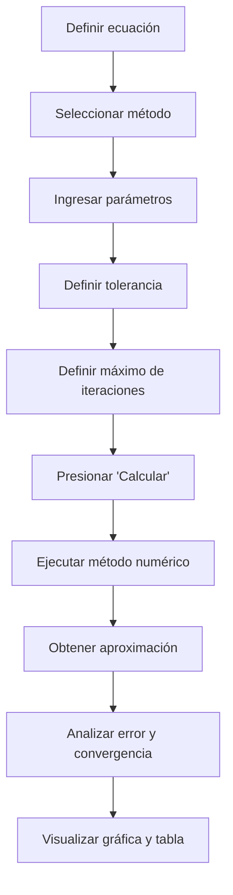
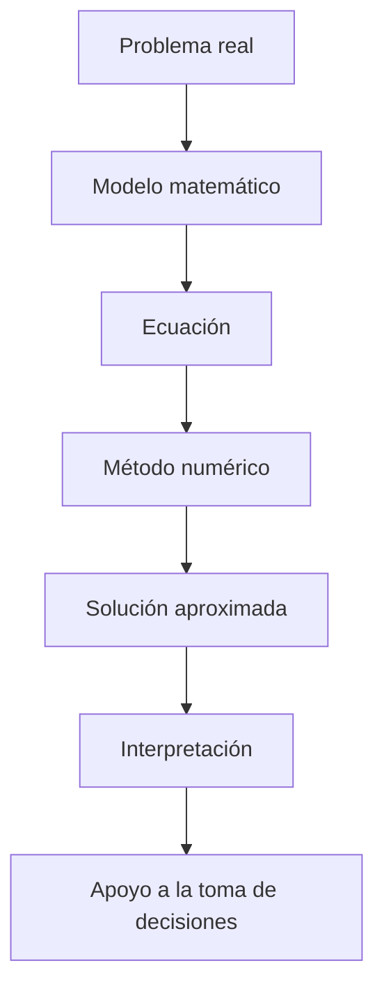

# 📘 Manual de Usuario — Numerix

> **Numerix — Calcula. Visualiza. Comprende.**

## 1. Introducción

**Numerix** es una aplicación web desarrollada en Python que permite resolver ecuaciones no lineales mediante diferentes métodos numéricos.

La aplicación está diseñada con un enfoque académico y educativo, permitiendo no solamente obtener una aproximación de la raíz de una ecuación, sino también **analizar el proceso iterativo utilizado para obtenerla**.

Numerix permite visualizar:

* La raíz aproximada encontrada.
* El valor de la función evaluada en la raíz.
* El error relativo porcentual.
* El número de iteraciones realizadas.
* La representación gráfica de la función.
* La tabla de iteraciones.
* Las fórmulas y fundamentos teóricos del método utilizado.
* La descarga de los resultados iterativos en formato CSV.

La herramienta está orientada principalmente a estudiantes y docentes de áreas relacionadas con ingeniería, matemáticas, computación e Investigación de Operaciones.

---

# 2. Objetivo de la aplicación

El objetivo principal de Numerix es facilitar la comprensión y aplicación de métodos numéricos para la solución de ecuaciones no lineales.

A diferencia de una calculadora convencional, Numerix busca mostrar **cómo se obtiene la solución**, permitiendo al usuario analizar el comportamiento del método durante sus iteraciones.

El flujo general de trabajo es:



---

# 3. Requisitos para utilizar Numerix

Para utilizar Numerix como usuario final no es necesario conocer programación.

El usuario únicamente necesita:

* Acceso a la aplicación. https://numerix-app.streamlit.app/
* Conocer la ecuación que desea resolver.
* Conocer o estimar los parámetros iniciales requeridos por el método.
* Definir una tolerancia apropiada.
* Definir un número máximo de iteraciones.

Si la aplicación se ejecuta localmente, los requisitos técnicos de instalación se encuentran descritos en el **Manual Técnico**.

---

# 4. Interfaz principal

Al iniciar Numerix se presenta la interfaz principal de la aplicación.

La interfaz está dividida en dos áreas principales:

### Barra lateral

La barra lateral contiene los controles necesarios para configurar el problema:

* Categoría.
* Método.
* Función.
* Parámetros iniciales.
* Tolerancia.
* Máximo de iteraciones.
* Botón **⚡ Calcular**.

### Panel principal

El panel principal presenta:

* Nombre de la aplicación.
* Método seleccionado.
* Enlaces de documentación.
* Resultados numéricos.
* Gráfica.
* Tabla de iteraciones.
* Fundamento teórico.

Cuando todavía no se ha ejecutado ningún cálculo, se muestra el mensaje:

> **Listo para resolver**

junto con una indicación para configurar los parámetros y presionar **Calcular**.

---

# 5. Navegación y documentación

La documentación se encuentra separada de la selección de métodos para mantener una interfaz limpia.

En la parte superior derecha del panel principal se encuentran los accesos:

* 📘 **Usuario**
* 🛠️ **Técnico**

### Manual de Usuario

Explica el funcionamiento de la aplicación desde el punto de vista del usuario final.

### Manual Técnico

Describe la arquitectura, estructura de archivos, componentes y procedimientos necesarios para ejecutar y mantener el sistema.

Para regresar al solucionador desde cualquiera de los manuales se utiliza el botón:

**← Volver**

---

# 6. Selección de categoría

La aplicación organiza los métodos numéricos mediante categorías.

Actualmente se encuentran disponibles:

### Métodos Cerrados

* Bisección
* Regula Falsi

### Métodos Abiertos

* Newton-Raphson
* Secante
* Punto Fijo

### Polinomios / Otros

Esta sección está preparada para incorporar métodos adicionales, como Müller o Bairstow, conforme avance el desarrollo del proyecto.

> **Nota:** Un método que todavía no haya sido implementado completamente no debe utilizarse para obtener resultados finales.

---

# 7. Selección del método

Después de seleccionar una categoría, el usuario debe elegir el método específico.

Cada método requiere diferentes parámetros iniciales.

| Método         | Tipo    | Parámetros principales |
| -------------- | ------- | ---------------------- |
| Bisección      | Cerrado | a, b                   |
| Regula Falsi   | Cerrado | a, b                   |
| Newton-Raphson | Abierto | x₀                     |
| Secante        | Abierto | x₀, x₁                 |
| Punto Fijo     | Abierto | x₀                     |

La elección del método debe realizarse de acuerdo con las características de la ecuación y las condiciones iniciales disponibles.

---

# 8. Ingreso de la función

La función debe introducirse en el campo correspondiente de la barra lateral.

Numerix utiliza sintaxis compatible con Python/SymPy.

## Ejemplos válidos

### Polinomios

```text
x**3 - x - 2
```

```text
x**2 - 4
```

```text
2*x**3 + 4*x - 7
```

### Multiplicación

Se recomienda utilizar `*` para indicar multiplicaciones:

```text
4*x
```

```text
3*x**2
```

```text
2*(x + 1)
```

### Funciones trascendentes

```text
exp(x)
```

```text
sin(x)
```

```text
cos(x)
```

```text
log(x)
```

### Potencias

```text
x**3
```

También puede utilizarse la notación:

```text
x^3
```

cuando la función sea procesada por el parser de la aplicación.

---

# 9. Consideraciones para Punto Fijo

El método de Punto Fijo utiliza una formulación diferente.

En este caso, el usuario no debe introducir directamente:

```text
f(x) = 0
```

Debe ingresar la función despejada:

```text
x = g(x)
```

Por ejemplo, si se desea trabajar con:

```text
x^3 - x - 2 = 0
```

se debe obtener previamente una expresión equivalente de la forma:

```text
x = g(x)
```

y escribir únicamente la función `g(x)` en el campo correspondiente.

Ejemplo:

```text
(x + 2)**(1/3)
```

La aplicación utilizará entonces la relación:

```text
x(i+1) = g(xi)
```

---

# 10. Configuración de parámetros

Los parámetros disponibles dependen del método seleccionado.

## 10.1 Bisección

Se requieren:

* Límite inferior `a`.
* Límite superior `b`.

El intervalo debe ser seleccionado de manera que sea adecuado para la aplicación del método.

En términos generales, para una función continua debe existir un cambio de signo:

```text
f(a) · f(b) < 0
```

---

## 10.2 Posicion Falsa

Se requieren:

* Límite inferior `a`.
* Límite superior `b`.

Al igual que Bisección, utiliza un intervalo que permita identificar un cambio de signo.

---

## 10.3 Newton-Raphson

Se requiere:

* Punto inicial `x₀`.

La elección del punto inicial puede influir significativamente en la convergencia del método.

---

## 10.4 Secante

Se requieren dos puntos:

* `x₀`
* `x₁`

Estos puntos sirven como aproximaciones iniciales para construir sucesivamente la secante.

---

## 10.5 Punto Fijo

Se requiere:

* Punto inicial `x₀`.

Además, la función ingresada debe corresponder a `g(x)`.

---

# 11. Tolerancia

La tolerancia determina el nivel de precisión requerido para considerar que el proceso iterativo ha alcanzado una aproximación aceptable.

Por ejemplo:

```text
0.0001
```

representa una tolerancia pequeña y exige mayor precisión.

Una tolerancia demasiado exigente puede requerir más iteraciones.

Por otra parte, una tolerancia demasiado grande puede producir una aproximación menos precisa.

La elección debe realizarse considerando el problema que se está resolviendo.

---

# 12. Máximo de iteraciones

El campo **Máx. iteraciones** establece el número máximo de pasos que el método puede realizar.

Por ejemplo:

```text
50
```

significa que el algoritmo podrá realizar como máximo 50 iteraciones.

Este límite evita que un proceso que no converge continúe indefinidamente.

Una cantidad adecuada depende de:

* Método utilizado.
* Función.
* Punto inicial.
* Intervalo.
* Tolerancia.

---

# 13. Ejecución del cálculo

Una vez configurados todos los parámetros, se debe presionar:

**⚡ Calcular**

La aplicación ejecutará el método seleccionado utilizando los datos proporcionados.

Si la función y los parámetros son válidos, Numerix mostrará los resultados en el panel principal.

Si ocurre algún problema durante la ejecución, la aplicación mostrará un mensaje de atención para indicar la situación detectada.

---

# 14. Resultados principales

Después de ejecutar un método, Numerix presenta cuatro indicadores principales.

## 14.1 Raíz encontrada

Representa la aproximación de la raíz obtenida:

```text
xr
```

Por ejemplo:

```text
1.521380
```

Esta es la solución aproximada proporcionada por el método.

---

## 14.2 Valor f(xr)

Representa el valor de la función evaluada en la aproximación obtenida:

```text
f(xr)
```

Idealmente, este valor debe encontrarse cercano a cero.

Por ejemplo:

```text
0.00e+00
```

Un valor cercano a cero indica que la aproximación satisface con buena precisión la ecuación original.

---

## 14.3 Error relativo

Representa el error relativo porcentual utilizado para evaluar la aproximación entre iteraciones.

Se muestra como:

```text
Error relativo (%)
```

Un error menor indica una aproximación más estable entre iteraciones sucesivas.

---

## 14.4 Iteraciones

Indica la cantidad de iteraciones utilizadas por el método antes de alcanzar el criterio de parada o llegar al máximo permitido.

Este indicador permite comparar el comportamiento de diferentes métodos.

---

# 15. Gráfica interactiva

La pestaña:

**📊 Gráfica Interactiva**

permite visualizar el comportamiento de la función.

Para los métodos de búsqueda de raíces se muestra:

* Curva de la función.
* Eje horizontal `x`.
* Eje vertical `y`.
* Línea de referencia `y = 0`.
* Punto correspondiente a la raíz encontrada.

La representación permite observar visualmente dónde se encuentra la solución.

La gráfica es interactiva y permite explorar los valores representados.

---

# 16. Gráfica de Punto Fijo

El método de Punto Fijo utiliza una representación ligeramente diferente.

Se muestran:

```text
g(x)
```

y

```text
y = x
```

La intersección entre ambas curvas representa el punto fijo.

La raíz calculada se identifica mediante un marcador.

Esta representación permite comprender gráficamente la condición:

```text
x = g(x)
```

---

# 17. Tabla de iteraciones

La pestaña:

**📋 Tabla de Iteraciones**

permite observar el procedimiento paso a paso.

La tabla contiene la información generada por el método numérico.

Dependiendo del método implementado, puede incluir información como:

* Número de iteración.
* Aproximación.
* Evaluación de la función.
* Error.
* Intervalos.
* Otros valores intermedios.

La tabla permite verificar el comportamiento de la convergencia y estudiar el procedimiento utilizado para obtener la solución.

---

# 18. Descarga de resultados

Numerix permite descargar la tabla de iteraciones mediante el botón:

**📥 Descargar iteraciones en CSV**

El archivo generado puede abrirse utilizando herramientas como:

* Microsoft Excel.
* Google Sheets.
* LibreOffice Calc.
* Python/Pandas.
* Otros programas compatibles con CSV.

Esto permite conservar evidencia del proceso numérico y utilizar los datos para análisis posteriores.

---

# 19. Fundamento teórico

La pestaña:

**📖 Fundamento Teórico**

presenta información matemática relacionada con el método seleccionado.

## Bisección

La aproximación se calcula mediante:

```text
xr = (a + b) / 2
```

El método divide progresivamente el intervalo para aproximarse a la raíz.

---

## Posicion Falsa

Utiliza una interpolación lineal entre los extremos del intervalo para aproximar la raíz.

Su formulación permite conservar el criterio de intervalo utilizado por los métodos cerrados.

---

## Newton-Raphson

Utiliza:

```text
x(i+1) = xi - f(xi) / f'(xi)
```

El método utiliza la derivada de la función para obtener una nueva aproximación.

---

## Secante

Utiliza dos aproximaciones anteriores para construir una aproximación de la derivada:

```text
x(i+1) =
xi - [f(xi)(xi - x(i-1))] / [f(xi) - f(x(i-1))]
```

---

## Punto Fijo

Utiliza:

```text
x(i+1) = g(xi)
```

partiendo de una función expresada como:

```text
x = g(x)
```

---

# 20. Interpretación de los resultados

El resultado numérico debe interpretarse dentro del contexto del problema.

Una raíz aproximada no debe considerarse únicamente como un número.

El usuario debe analizar:

1. Si la aproximación es razonable.
2. Si el valor `f(xr)` está suficientemente cercano a cero.
3. Si el error cumple la tolerancia establecida.
4. Cuántas iteraciones fueron necesarias.
5. Si el comportamiento observado es consistente con el método utilizado.

En problemas de Ingeniería o Investigación de Operaciones, la solución matemática debe posteriormente relacionarse con las variables del problema original.

---

# 21. Recomendaciones de uso

Para obtener resultados confiables se recomienda:

* Verificar correctamente la ecuación.
* Utilizar paréntesis cuando sean necesarios.
* Revisar las unidades y significado de las variables.
* Elegir adecuadamente los puntos iniciales.
* Utilizar intervalos apropiados para métodos cerrados.
* Seleccionar una tolerancia coherente con la precisión requerida.
* Establecer un número máximo razonable de iteraciones.
* Revisar la tabla de iteraciones.
* Verificar visualmente la raíz mediante la gráfica.
* No asumir que todos los métodos convergerán para cualquier función.

---

# 22. Errores y situaciones comunes

## Función inválida

Si la expresión matemática contiene una sintaxis incorrecta, la aplicación puede generar un mensaje de error.

**Solución:** revisar operadores, paréntesis, nombres de funciones y variable utilizada.

---

## División entre cero

Algunos métodos pueden encontrar denominadores iguales o muy cercanos a cero durante el proceso.

**Solución:** revisar los puntos iniciales y la función utilizada.

---

## Falta de convergencia

Un método abierto puede no converger para determinados puntos iniciales o funciones.

**Solución:** cambiar los valores iniciales, revisar la función o utilizar otro método.

---

## Intervalo inadecuado

Los métodos cerrados requieren condiciones apropiadas en el intervalo.

**Solución:** verificar `a`, `b` y el comportamiento de la función.

---

## Máximo de iteraciones alcanzado

Si el método llega al número máximo de iteraciones sin satisfacer la condición de parada, se debe analizar si:

* La tolerancia es demasiado exigente.
* Los parámetros iniciales no son adecuados.
* La función presenta un comportamiento problemático.
* El método no es apropiado para el problema.

---

# 23. Buenas prácticas académicas

Numerix debe utilizarse como una herramienta de apoyo al aprendizaje.

Se recomienda que el usuario:

* Comprenda el método antes de utilizarlo.
* Compare los resultados con cálculos manuales cuando sea necesario.
* Analice las iteraciones.
* Interprete el error.
* Comprenda por qué el método converge o no converge.
* No utilice el resultado como sustituto del análisis matemático.

El propósito de Numerix es facilitar la comprensión del procedimiento, no ocultarlo.

---

# 24. Relación con Investigación de Operaciones

Los métodos numéricos implementados en Numerix pueden utilizarse como herramientas computacionales dentro del proceso de resolución de problemas matemáticos.

El flujo conceptual puede representarse como:



Por esta razón, Numerix puede servir como herramienta de apoyo para el análisis de problemas de ingeniería y de Investigación de Operaciones en los que sea necesario resolver ecuaciones numéricamente.

---

# 25. Cierre

Numerix busca integrar tres elementos:

**Cálculo + Análisis + Visualización**

El usuario no solamente obtiene una aproximación numérica, sino que puede observar el proceso mediante el cual se obtiene.

> **Numerix — Calcula. Visualiza. Comprende.**
